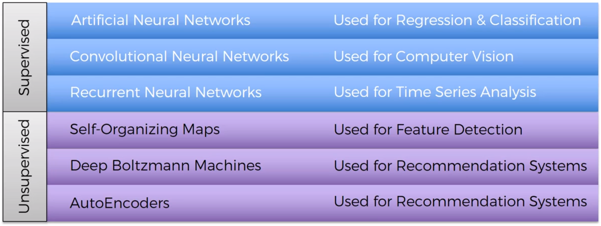
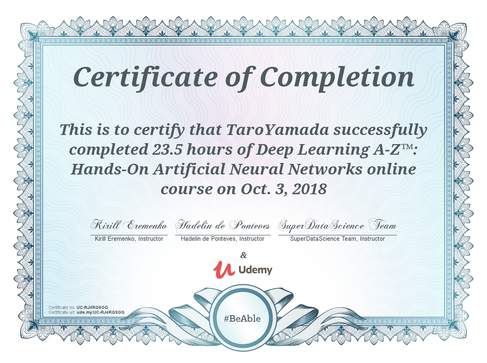

# DeepLearningA-Z
Deep Learning A-Z course at Udemy (https://www.udemy.com/deeplearning/learn/v4/overview)
>This online course provide the opportunity to learn about the following Artificial Neural Netowrk (ANN) related algorithms in Python 3.
- ANN
- Convoluted NN (CNN)
- Recurrent NN (RNN), mainly Long-short Term Memory (LSTM)
- Self Organizing Map (SOM)
- Restricted Boltzmann Machine, 
- Auto Encoders

All the source code I wrote in this course and the data files are available in the following links.

- (Basic) Artificial Neural Network (ANN) : https://nbviewer.jupyter.org/github/kensaku-okada/DeepLearningA-Z/blob/master/deepNNMain/Volume%201%20-%20Supervised%20Deep%20Learning/Part%201%20-%20Artificial%20Neural%20Networks%20%28ANN%29/Section%204%20-%20Building%20an%20ANN/myAnn.ipynb
- CNN : http://nbviewer.jupyter.org/gist/p1c0sovm9DfTaw/398f65039ae97c5cd8e357dc3af13592
- RNN : http://nbviewer.jupyter.org/gist/p1c0sovm9DfTaw/87eba08ce71c03eaf9ee3f60f9f38e89
- Self Organizing Map (SOM) : http://nbviewer.jupyter.org/gist/p1c0sovm9DfTaw/2785854ec556a162243fab8ab6e228db
- Restricted Boltzmann Machine (RBM): http://nbviewer.jupyter.org/gist/p1c0sovm9DfTaw/e285868e9c4f3acecab48c3b0d77449a
- Auto Encoder : http://nbviewer.jupyter.org/gist/p1c0sovm9DfTaw/91fdaf2010d2fd487ea28bd5441b7342

The overview of this course is available at https://www.udemy.com/deeplearning/learn/v4/overview.  
The course detail is available at https://www.udemy.com/deeplearning/learn/v4/content.

# Certificate of Completion

